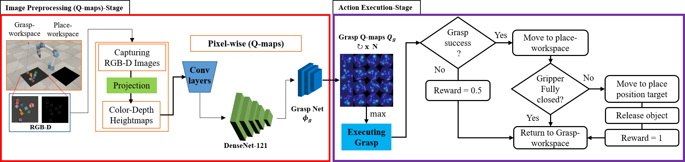

# Learning-Pick-to-Place-Objects-in-a-cluttered-scene-using-deep-reinforcement-learning

Proposes an efficient grasp-to-place strategy for robotic manipulation in sparse environments using a deep Q-network. Requires less computation and time, generalizes well across scenarios, and achieves optimal grasp points via trial-and-error learning. Demonstrated effectiveness with a UR5 robotic arm and Parallel-jaw gripper.

# Setting and Installation

This implementation has the following dependencies, which have been tested on Ubuntu 19.04.4 LTS:

1. Python 2.7 or Python 3
2. [NumPy](https://anaconda.org/anaconda/numpy), [SciPy](https://anaconda.org/anaconda/SciPy), [OpenCV](https://anaconda.org/anaconda/OpenCV), [Matplotlib](https://anaconda.org/anaconda/Matplotlib). Easily install/update these dependencies by executing the following command (use pip3 instead of pip for Python 3 or "conda"):
    ```
    conda install -c anaconda numpy scipy opencv matplotlib
    ```
3. PyTorch version 1.0+:
    ```
    pip install torch==0.3.1 torchvision==0.2.0
    ```
    Followed by:
    ```
    pip install torch torchvision
    ```    
4. V-REP, now known as CoppeliaSim, is the required simulation environment. [Download it here](https://www.coppeliarobotics.com/)


# Introduction

**Purpose:** Enhancing robotic grasping in a cluttered environment using RL.

- **Key Features:**
    1. **Effective Grasp-to-Place Strategy:** 
        Our approach focuses on a grasp-to-place strategy tailored for manipulating objects in sparse and chaotic environments.

    2. **Minimal Computing Resources:** 
        By utilizing raw RGB-D images through an explicit architecture, our method significantly reduces the need for computing processes, expedites simulation training, and maintains effectiveness across diverse object types and scenarios.

    3. **Trial-and-Error Learning:** 
        The approach learns optimal grasp points through trial-and-error, employing a fully conventional network to map visual input into pixel-wise Q-values representing grasp orientation and pose.

# The Project Approach



The proposed approach is intended to minimize the demands of the computing process, which could have an impact on the cost of time used during operation (Figure 1). The approach architecture is designed to run in a reasonable amount of time on a moderate CPU or GPU. The purpose of this paper is also to create a self-supervised learning manipulation approach that avoids the inherent complexity of approach architecture.

Firstly, the camera captures the RGB-D images, which then projected to generate the color () and depth () heightmaps. The  and  will be rotated () before being forwarded into the conventional layers (a 2-layer residual networks [35]). The residual networks will reduce the input parameters of DenseNet-121 to be 1024 instead 2048, which can effectively minimize the time-consuming, and run on moderate CPU and GPU.  Then, the extracted features are then fed to a DenseNet-121 [36], a pre-trained model on ImageNet [37], to create motion agnostic features. Then, the motion agnostic features are used as inputs by the grasp net  followed by bilinear upsampling, which estimates the grasp Q-maps  . A three-layer residual network is used in the .  Finally, the robot executes the predicted best grasp, corresponding to the highest Q-value. Rewards are then assigned automatically depending on the success of grasps. The experience replay [38] is employed, which used to store the agent's experiences at each time step in a data set  that is pooled across many episodes to create a replay memory. Then, like with DQN, we randomly sample the memory for a minibatch of experience and utilize this to train off-policy.

# Domonstration Vidoes


# Train command

1. Train robot with GPU---> at least 4gb:
    ```
    python main.py --is_sim --obj_mesh_dir objects/blocks --grasp_rewards --experience_replay --save_visualizations
    ```
2. Train robot with CPU:
    ```
    python main.py --is_sim --obj_mesh_dir objects/blocks --grasp_rewards --experience_replay --save_visualizations --cpu
    ```
# Test Scenarios:
1. Sparsely Scenario: 
    ```
    python main.py --is_sim --obj_mesh_dir objects/blocks --num_obj 10 --grasp_rewards --experience_replay  --is_testing --test_preset_cases --test_preset_file 'simulation/test-cases/"SCS-1"' --load_snapshot --snapshot_file 'logs/train/models/snapshot-backup.reinforcement.pth'  --save_visualizations>
    ```
    Then the you can use your own test case by replacing SCS-1 to your test, or if you want to use our test scenarios, replace SCS-1 with "SCS-2" Or "SCS-3"

2. Meduim Scenario:
    ```
    python main.py --is_sim --obj_mesh_dir objects/blocks --num_obj 20 --grasp_rewards --experience_replay  --is_testing --test_preset_cases --test_preset_file 'simulation/test-cases/MCS-1' --load_snapshot --snapshot_file 'logs/train/models/snapshot-backup.reinforcement.pth'  --save_visualizations
    ```
    Then the you can use your own test case by replacing MCS-1 to your test, or if you want to use our test scenarios, replace MCS-1 with "MCS-2" Or "MCS-3"
    
3. Densely Scenario:
    ```
    python main.py --is_sim --obj_mesh_dir objects/blocks --num_obj 20 --grasp_rewards --experience_replay  --is_testing --test_preset_cases --test_preset_file 'simulation/test-cases/DCS-1' --load_snapshot --snapshot_file 'logs/train/models/snapshot-backup.reinforcement.pth'  --save_visualizations
    ```

    ```
    python main.py --is_sim --obj_mesh_dir objects/blocks --num_obj 30 --grasp_rewards --experience_replay  --is_testing --test_preset_cases --test_preset_file 'simulation/test-cases/DCS-2' --load_snapshot --snapshot_file 'logs/train/models/snapshot-backup.reinforcement.pth'  --save_visualizations
    ```

    ```
    python main.py --is_sim --obj_mesh_dir 'objects/blocks' --num_obj 40 --grasp_rewards --experience_replay  --is_testing --test_preset_cases --test_preset_file 'simulation/test-cases/DCS-3' --load_snapshot --snapshot_file 'logs/train/models/snapshot-backup.reinforcement.pth'  --save_visualizations
    ```

# Citing:
If you found this project useful please cite the work: Marwan Qaid Mohammed, Lee Chung Kwek and Shing Chyi Chua, “Learning Pick to Place Objects using Self-supervised Learning with Minimal Training Resources” International Journal of Advanced Computer Science and Applications(IJACSA), 12(10), 2021. 
[Download it here](http://dx.doi.org/10.14569/IJACSA.2021.0121056) 

# Note: 
This project is modified of the "https://github.com/andyzeng/visual-pushing-grasping/tree/master"


